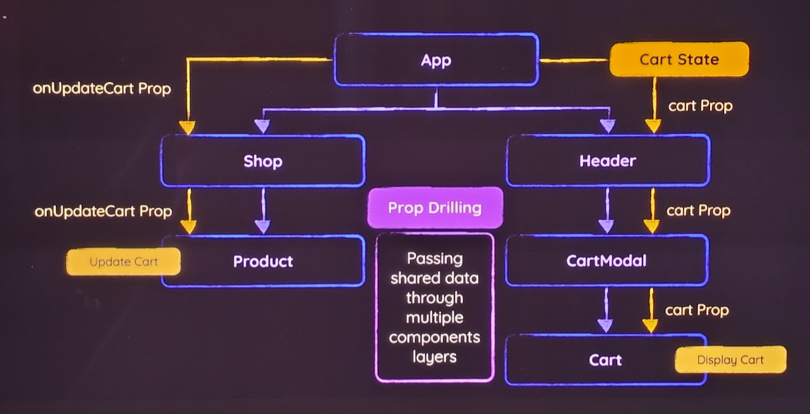
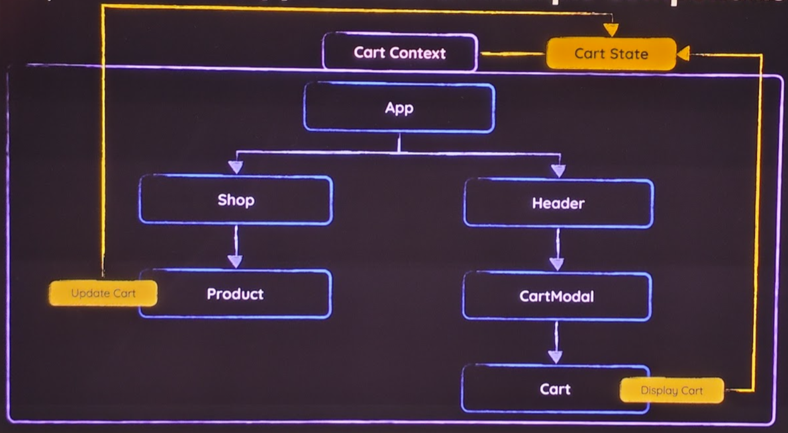

# React State Management

## `useState` hook

```tsx
// when changed - component func is re-executed !!!!!
// calling `setCount()` will schedule an update, so it won't be instant
const [count, setCount] = useState<number>(0);
const [arr, setArr] = useState<number>([...]);

// WRONG - don't use this approach when new state depends on old state
setCount(!count);

// CORRECT - pass function instead, it will always get correct state value
setCount((count) => !count); // best practice

// WRONG
setArr((obj) => arr[0] = 'new value')

// CORRECT
setArr((obj) => {
  // clone 1d array
  const newArray = [...arr];
  // clone 2d array
  const newArray = [...arr.map(innerArray => [...innerArray])];
  // PS: use deep cloning for complex objects

  newArray[0] = 'new value';
  return newArray;
})
```

## Two-way binding

```tsx
function Component() {
  const [name, setName] = useState("Initial Name");
  return <input value={name} onChange={(e) => setName(e.target.value)} />;
}
```

## Lifting state up

In case when one of children affects a sibling - state should be managed by the common parent.

```tsx
// common parent
function Accordion({ title, children, isActive }) {
  // manage shared state in parent
  const [activeIndex, setActiveIndex] = useState(0);

  return (
    <>
      <Panel
        isActive={activeIndex === 0}
        onShow={() => setActiveIndex(0)}>
        ...
      </Panel>
      <Panel
        isActive={activeIndex === 1}
        onShow={() => setActiveIndex(1)}>
        ...
      </Panel>
    </>
  );
}

// siblings
function Panel({ children, isActive, onShow }) {
  return (
    {isActive ? (
        <p>{children}</p>
      ) : (
        <button onClick={onShow}>
          Show
        </button>
      )}
  );
}
```

## Ref vs State :

- Refs:

  - `ref.current.value = '...'` won't re-evaluated component func
  - use to get direct DOM element access
  - use to keep values that should not be lost during the component function re-evaluation
  - use for reading values or accessing browser APIs
  - don't use for UI value bindings, use State instead

- State:
  - `setState(...)` will re-evaluate component func
  - use for UI bindings
  - don't use for values that have no effect on UI, use Ref instead

## Sharing state between components

### Prop drilling

Prop drilling - passing shared data through multiple components layers



### Component Composition approach

Manage/Own content in a top lvl component instead of inner components, and refactor inner components to act only as a wrapper components. Pass content as a `children`.

This might lead to bloated top lvl component.

### Context API



1. Create a context file

It is common convention to store context files in a src/store

```jsx
// src/store/shopping-cart-context.jsx

import { createContext } from "react";

// values from here won't get used, but they used for auto-completion
export const CartContext = createContext({
  items: [],
  addItemToCart: () => {},
});
```

2. Provide context by wrapping the content that should access that context with it. Add default `value` to it.

```jsx
// src/store/shopping-cart-context.jsx

inport { CartContext } from './store/shopping-cart-context.jsx';

function App() {
  const [shoppingCart, setShoppingCart] = useState({
    items: []
  })

  const ctxValue = {
    items: shoppingCart.items,
    addItemToCart: handleAddItemToCart
  };

  return (
    // For React 19 and above
    <CartContext value={ctxValue}>
      <Header />
      <Shop>
        {PRODUCTS.map(product => (
          <li key={product.id}>
            <Product onAddToCart={handleAddItemToCart} />
          </li>
        ))}
      </Shop>
    </CartContext>

    // For React 18 and below
    // <CartContext.Provider value={ctxValue}>
    //   ...
    // <CartContext.Provider>
  )
}
```

3. Consume context

```jsx
// can be used in `if` block
// Available only in React 19 +
// import { use } from 'react';
import { useContext } from 'react';

inport { CartContext } from '../store/shopping-cart-context.jsx';

export default function Cart() {
  // Available only in React 19 +
  // const cartCtx = use(CartContext);
  // const cartCtx = useContext(CartContext);
  const { items } = useContext(CartContext);

  return (
    <div id="cart">
      {!items.length && <p>No items in cart!</p>}
      {items.length && (
        items.map(item => {
          ...
        })
      )}
    </div>
  )
}
```

```jsx
import { useContext } from "react";
import { CartContext } from "../store/shopping-cart-context.jsx";

export default function Product() {
  const { addItemToCart } = useContext(CartContext);

  return (
    <article className="product">
      ...
      <button onClick={() => addItemToCart(id)}>Add to Cart</button>
    </article>
  );
}
```
