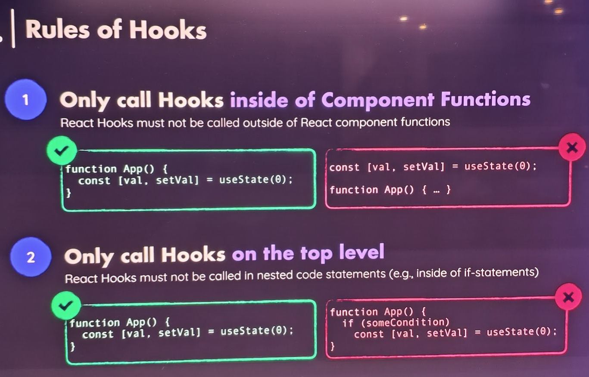

# React Custom Hooks

## Rules of hooks

- Hooks should be called at the top level of the component.
- Hooks should be called inside the Component Functions (or custom hooks).



## Custom Hooks

Problems it can solve:

- Share/Reuse logic - between different components
- Complex logic - can be broken down into smaller parts

## Example

```jsx
// src/hooks/useDocumentTitle.js

import { useState, useEffect } from "react";

// must start with `use` to enforce the rules of hooks
export function useDocumentTitle(someFunc, initialCount) {
  // now state is managed in the custom hook
  const [count, setCount] = useState(initialCount);

  useEffect(() => {
    document.title = `Count ${count}`;
  }, [count]);

  // expose the state and the setter
  return { cont, setCount };
}
```

Use it like this:

```jsx
import { useDocumentTitle } from "./hooks/useDocumentTitle";

const { cont } = useDocumentTitle(count, 0);
```
