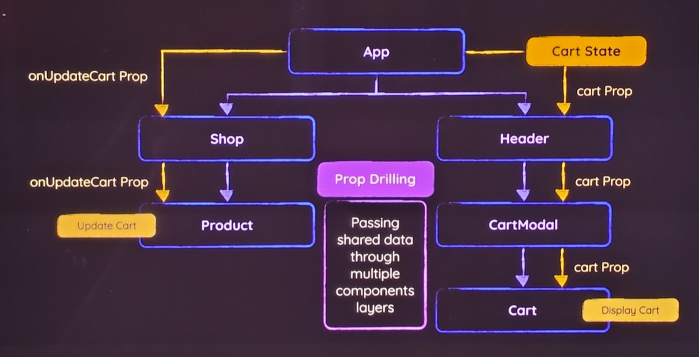
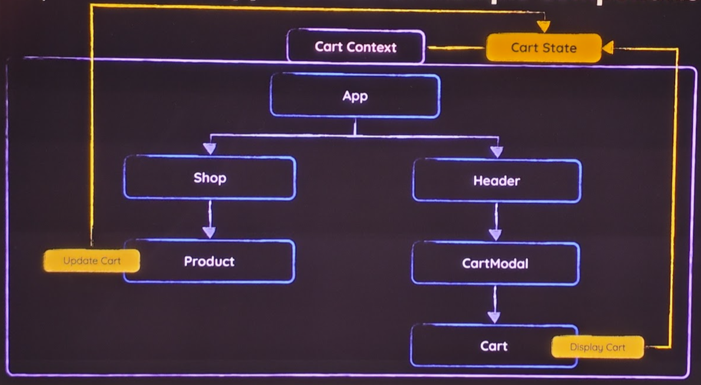

# Context API

## Sharing state between components

For sharing a data between components, there are several approaches:

- prop drilling (bad practice). Passing shared data (props) through multiple component layers
- component composition (partial solution). It is when a parent component passes data to a child component via content, and a child component acts as a wrapper around it.
- context API (best practice). It is when a parent component provides data to all its children, no matter how deep they are in the component tree.

## Context API overview

Problem:

Passing props through multiple levels of components (also known as a pros drilling) is cumbersome and error-prone.



Solution:

Context API is used to share data between components without passing props through every level of the tree. When the context changes, all components that consume that context will re-render.



## Example

1. Create a context file

It is common convention to store context files in `src/store`.
This context file should contain the context object
It might export a provider component (wrapper that handles all state logic), or consuming component can manage it as well.

```jsx
// src/store/shopping-cart-context.jsx

import { createContext, useState } from "react";

// Default values are used for auto-completion and as fallback values
export const CartContext = createContext({
  items: [],
  addItemToCart: () => {},
});

// if context file doesn't provide such a component, consuming component should manage it
export default CartContextProvider({ children }) {
  const [shoppingCart, setShoppingCart] = useState({
    items: [],
    addItemToCart: handleAddItemToCart,
  });

  const ctxValue = {
    items: shoppingCart.items,
    addItemToCart: handleAddItemToCart,
  };

  function handleAddItemToCart(id) {
    setShoppingCart((prevCart) => {...});
  }

  return
    // For React 18 and below
    <CartContext.Provider value={ctxValue}>
      {children}
    </CartContext.Provider>;

    // For React 19 and above
    // <CartContext value={ctxValue}>
    //   {children}
    // </CartContext>

};
```

2. Provide context by wrapping the content that should access that context with it. Add default `value` to it.

```jsx
// App.jsx

import { CartContext } from "./store/shopping-cart-context.jsx";

function App() {
  const { handleAddItemToCart } = useContext(CartContext);
  return (
    // TODO: check this wrapper
    <CartContextProvider>
      <Header />
      <Shop>
        {PRODUCTS.map((product) => (
          <li key={product.id}>
            <Product onAddToCart={handleAddItemToCart} />
          </li>
        ))}
      </Shop>
    </CartContextProvider>
  );
}
```

3. Consume context

```jsx
// Cart.jsx

// can be used in `if` block
// Available only in React 19 +
// import { use } from 'react';
import { useContext } from "react";

import { CartContext } from "../store/shopping-cart-context.jsx";

export default function Cart() {
  // Available only in React 19 +
  // const cartCtx = use(CartContext);
  const { items } = useContext(CartContext);

  return (
    <div id="cart">
      {!items.length && <p>No items in cart!</p>}
      {items.length && items.map((item) => {})}
    </div>
  );
}
```

```jsx
// Product.jsx

import { useContext } from "react";
import { CartContext } from "../store/shopping-cart-context.jsx";

export default function Product({ id }) {
  const { addItemToCart } = useContext(CartContext);

  return (
    <article className="product">
      ...
      <button onClick={() => addItemToCart(id)}>Add to Cart</button>
    </article>
  );
}
```

Alternative way of using context is to wrap the component with `<CartContext.Consumer>`. Older projects might still use this approach. This one is harder to read and maintain and is considered not a best practice.

```jsx
// Cart.jsx

import { CartContext } from "../store/shopping-cart-context.jsx";

export default function Cart() {
  return (
    <CartContext.Consumer>
      {(ctx) => (
        <div id="cart">
          {!ctx.items.length && <p>No items in cart!</p>}
          {ctx.items.length && (
            ctx.items.map((item) => {
              ...
            })
          )}
        </div>
      )}
    </CartContext.Consumer>
  );
}
```
